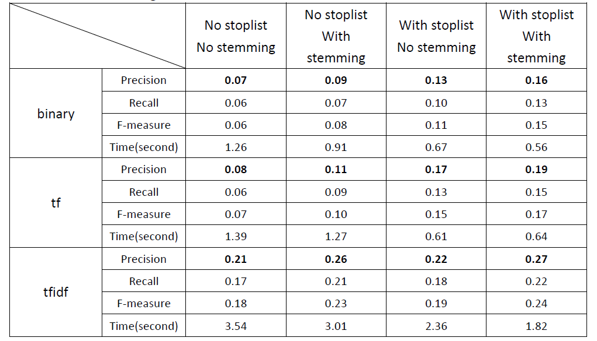

# Document Retrieval

## Description

**Task:**  Complete the implementation of a basic document retrieval system in Python.

The purpose of this project is to perform document retrieval based on the *vector space model*. We have two important basic files available for the implementation of this system. The provided **query.txt** file contains a set of IR queries that can be used to retrieve relevant documents, and the **documents.txt** file is a document collection of all documents. These two files are pre-processed(whether a stoplist is used, whether terms are stemmed) based on the *inverted index* to effectively identify documents related to the query.

The implementation allow retrieval under alternative term weighting schemes, as selected using the \-w" command line flag, i.e. under ***binary***, ***term frequency*** and ***TFIDF*** schemes.

## Implementations

The implementation of the system is mainly divided into two steps. The *first step* is to view documents as vectors of term weighting. The *second step* is to rank the candidate documents according to the calculation of similarity between a document and a query.

For the calculation of term weighting, we describe this three schemes separately.

#### 1) Binary

If the term present in the document collection, the weight is 1, otherwise it is 0

#### 2) TF

The number of times a term appears in a specific document.

#### 3) TFIDF(TF multiply IDF)

For this formula, |𝐷| is total number of documents in collection, 𝑑𝑓𝑤 is number of documents containing term w.

With respect to the **second step**, the similarity calculation formula as follow:

When we have calculated the similarity of each candidate document with query, we rank this documents according to the magnitude of the similarity value, that is, the larger the similarity value, the higher the relevance of the document to the query.

## Result

The test results of the system under different configurations are as follows.

